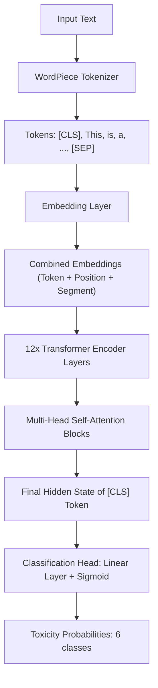

# BERT Toxicity & Architecture Explainer
## 🎓 Demonstration Cheat Sheet & Presentation Guide

Welcome to the **BERT Toxicity Demonstration**. This guide acts as a cheat sheet for your presentation, outlining the core scientific concepts behind BERT, its architecture, and the fine-tuning process applied by Unitary AI to create the `detoxify` model.

---

### 🔍 1. What is BERT?
**BERT** stands for **Bidirectional Encoder Representations from Transformers**. It is a landmark language representation model introduced by Google in 2018.

* **Bidirectional Contextualization**: Traditional language models (like LSTMs or RNNs) read text sequentially—either left-to-right or right-to-left. BERT reads the **entire sequence of words at once** using the **Transformer Encoder**. This allows the representation of each word to incorporate context from both its left and its right simultaneously.
* **The Transformer Encoder**: Unlike the decoder part of the Transformer (which uses masking to hide future words during autoregressive generation), the encoder has full visibility. It processes all input tokens in parallel, which is ideal for classification tasks like toxicity detection.

---

### 🏗️ 2. Architecture Breakdown

To understand how BERT processes a sentence like *"This is a wonderful teaching aid."*, we look at the following key components:



#### A. WordPiece Tokenization & Special Tokens
* **`[CLS]` (Classification Token)**: Prepended to the beginning of every input sequence. Since BERT utilizes self-attention, the final hidden state of the `[CLS]` token aggregates information from all other tokens in the sequence, acting as a sentence-level representation.
* **`[SEP]` (Separator Token)**: Appended to the end of a sequence (or placed between two sentences) to explicitly mark sequence boundaries.
* **WordPiece Subwords (`##` prefix)**: If a word is not in BERT's 30,522-word vocabulary, the tokenizer breaks it down into subword units (e.g., `"unparalleled"` becomes `["un", "##para", "##lleled"]`). This prevents Out-Of-Vocabulary (OOV) errors and helps BERT learn from prefixes and suffixes.

#### B. The Embedding Layer
BERT combines three types of embeddings to form the initial input representation (typically a 768-dimensional vector per token for BERT-base):
1. **Token Embeddings**: Maps WordPiece tokens to their vector representations.
2. **Positional Embeddings**: Since Transformers process all tokens in parallel, they have no built-in sequence order awareness. Positional embeddings are added to provide the model with the exact position of each token in the sentence.
3. **Segment Embeddings**: Distinguishes between sentence A and sentence B (used in tasks like Question Answering, not utilized for single-sentence toxicity analysis).

#### C. Multi-Head Self-Attention
* **Self-Attention**: Allows each token to compute relationship weights with every other token in the sequence. For example, in the sentence *"The model predicted toxicity because **it** was toxic"*, self-attention allows **"it"** to strongly attend to **"model"**.
* **Multi-Head**: Instead of calculating attention once, BERT performs this calculation multiple times (12 heads in BERT-Base) in parallel. Each "head" can focus on different linguistic dependencies (e.g., one head handles syntax/subject-verb agreement, another handles coreference resolution, and another handles semantic associations).

---

### 🧪 3. How it was Fine-Tuned (Unitary AI Detoxify)

The model running in this application is the **Unitary AI original-toxic** model. Here is the process of how it was developed:

1. **Pre-Training**: The model started as a standard `bert-base-uncased` model pre-trained by Google on the BooksCorpus (800M words) and English Wikipedia (2,500M words) using two unsupervised tasks:
   * **Masked Language Modeling (MLM)**: Predicting randomly masked tokens in sentences.
   * **Next Sentence Prediction (NSP)**: Predicting whether sentence B naturally follows sentence A.

2. **Fine-Tuning on Jigsaw Dataset**:
   * **The Head Swap**: Unitary AI removed the pre-training MLM/NSP heads and replaced them with a new, untrained feed-forward Linear layer (Classification Head) mapping BERT's 768-dimensional `[CLS]` token output to **6 target dimensions** (one for each toxicity category).
   * **The Dataset**: The model was trained on the **Jigsaw Toxic Comment Classification** dataset (from a popular Kaggle competition), consisting of over 150,000 Wikipedia talk page comments labeled by human annotators.
   * **Multi-Label Loss**: The model uses Binary Cross-Entropy loss with a **Sigmoid** activation on the output logits. This calculates 6 independent probabilities (ranging from 0.0 to 1.0) rather than a single Softmax distribution, enabling comments to be classified as both "obscene" and "insult" simultaneously.

---

### 💻 4. Running the Application

To present this demo, start the FastAPI server with the virtual environment activated:

```powershell
# 1. Activate the Virtual Environment
.\venv\Scripts\Activate.ps1

# 2. Run the application using Uvicorn
python app.py
```

* Open your browser and navigate to: **`http://127.0.0.1:8000`**
* Type any sentence or select a preset to demonstrate BERT tokenization and the attention weights map.
